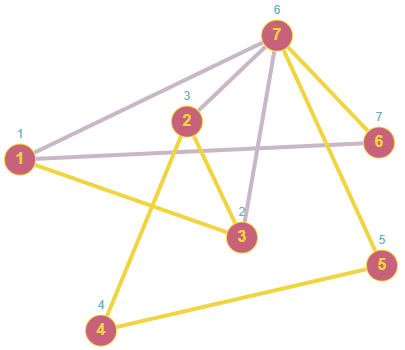
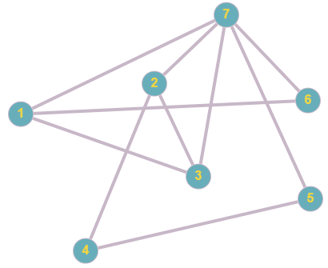
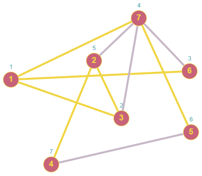
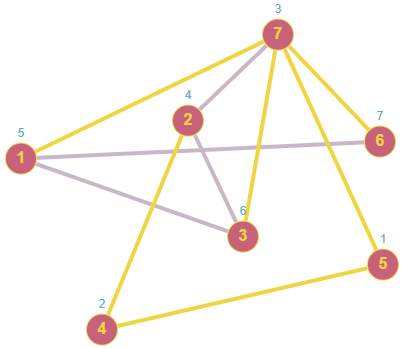
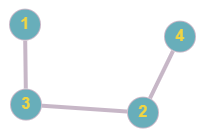
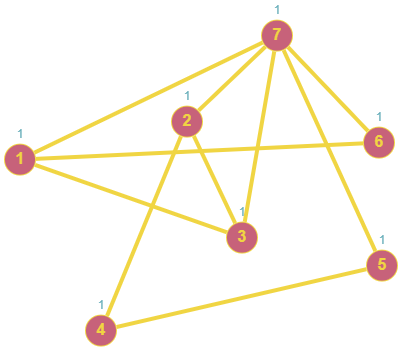
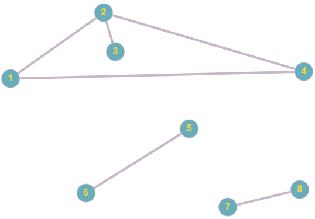
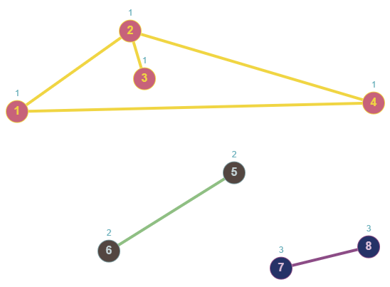

<details>
<summary><font size="+2">Задача 1. Обход в глубину</font></summary><br>

В этом задании нужно реализовать обход графа в глубину.

Граф представлен матрицей смежности размерностью `N x N` — это двумерный массив, содержащий `N` строчек и `N` столбцов.

`N` — это количество вершин графа. Все вершины графа пронумерованы, то есть имеют уникальный индекс от `1` до `N` включительно.

Значение, находящееся в ячейке матрицы смежности, говорит о наличии или отсутствии связи между вершинами, индексы которых соответствуют номеру строчки и номеру столбца этой ячейки. Если значение в ячейке равно `1`, то связь между вершинами есть. Если значение равно `0`, то связи между вершинами нет. В ячейках с одинаковыми номерами столбца и строки всегда находится `0`.

Ваша задача — имея предоставленную матрицу смежности, произвести обход графа, представленного этой матрицей, в глубину. При посещении каждой следующей ячейки ваша программа должна вывести на консоль индекс посещаемой ячейки.

Матрица смежности будет задаваться в текстовом файле в формате: первым числом в файле идёт количество вершин графа (`N`). Далее располагаются `N` строчек, каждая из которых содержит `N` чисел — `1` или `0`.

Обход графа начинается с первой вершины с индексом `1`.

<details>
<summary><font size="+1">Пример работы программы</font></summary>

#### Входящий файл `input.txt`:
```
7
0 0 1 0 0 1 1
0 0 1 1 0 0 1
1 1 0 0 0 0 1
0 1 0 0 1 0 0 
0 0 0 1 0 0 1 
1 0 0 0 0 0 1 
1 1 1 0 1 1 0
```
Визуализация графа:<br>

#### Вывод на консоль:
```
Порядок обхода вершин: 1 3 2 4 5 7 6
```
Визуализация обхода графа:<br>

</details>
</details>
<br>

<details>
<summary><font size="+2">Task 1. Traversal at the beginning</font></summary><br>

In this task you need to implement a depth-first traversal of a graph.

The graph is represented by an `N x N` adjacency matrix - a two-dimensional array containing `N` rows and `N` columns.

`N` is the number of vertices in the graph. All vertices of the graph are numbered, that is, they have a unique index from `1` to `N` inclusive.

The value found in a cell of the adjacency matrix indicates the presence or absence of a connection between the vertices, the indices of which correspond to the row number and column number of this cell. If the value in the cell is `1`, then there is a connection between the vertices. If the value is `0`, then there is no connection between the vertices. Cells with the same column and row numbers always contain `0`.

Your task is, given the provided adjacency matrix, to perform a depth-first traversal of the graph represented by this matrix. As you visit each subsequent cell, your program should print to the console the index of the cell being visited.

The adjacency matrix will be specified in a text file in the format: the first number in the file is the number of graph vertices (`N`). Next are `N` lines, each of which contains `N` numbers - `1` or `0`.

The traversal of the graph starts from the first vertex with index `1`.

<details>
<summary><font size="+1">Example of how the program works</font></summary>

#### Input file `input.txt`:
```
7
0 0 1 0 0 1 1
0 0 1 1 0 0 1
1 1 0 0 0 0 1
0 1 0 0 1 0 0
0 0 0 1 0 0 1
1 0 0 0 0 0 1
1 1 1 0 1 1 0
```
Graph visualization:<br>

#### Console output:
```
Vertex traversal order: 1 3 2 4 5 7 6
```
Visualization of graph traversal:<br>

</details>
</details>
<br>

<details>
<summary><font size="+2">Задача 2*. Обход в ширину</font></summary><br>

В этом задании вам нужно реализовать обход графа в ширину с возможностью выбора начальной вершины.

Граф представлен матрицей смежности размерностью `N x N` — это двумерный массив, содержащий `N` строчек и `N` столбцов.

`N` — это количество вершин графа. Все вершины графа пронумерованы, то есть имеют уникальный индекс от `1` до `N` включительно.

Значение, находящееся в ячейке матрицы смежности, говорит о наличии или отсутствии связи между вершинами, индексы которых соответствуют номеру строчки и номеру столбца этой ячейки. Если значение в ячейке равно `1`, то связь между вершинами есть. Если значение равно `0`, то связи между вершинами нет. В ячейках с одинаковыми номерами столбца и строки всегда находится `0`.

Ваша задача — имея предоставленную матрицу смежности, произвести обход графа, представленного этой матрицей, в ширину. При посещении каждой следующей ячейки ваша программа должна вывести на консоль индекс посещаемой ячейки.

Матрица смежности будет задаваться в текстовом файле в формате: первым числом в файле идёт количество вершин графа (`N`). Далее располагаются `N` строчек, каждая из которых содержит `N` чисел — `1` или `0`.

При старте программы дайте пользователю возможность выбрать вершину по индексу, с которой начнётся обход графа в ширину. Не забудьте убедиться, что пользователь ввёл допустимый индекс.

<details>
<summary><font size="+1">Пример работы программы</font></summary>

#### Входящий файл `input.txt`:
```
7
0 0 1 0 0 1 1
0 0 1 1 0 0 1
1 1 0 0 0 0 1
0 1 0 0 1 0 0 
0 0 0 1 0 0 1 
1 0 0 0 0 0 1 
1 1 1 0 1 1 0
```

Визуализация графа:<br>

#### Консоль:
```
В графе 7 вершин. Введите номер вершины, с которой начнётся обход: 1
Порядок обхода вершин: 1 3 6 7 2 5 4
```
Визуализация обхода графа, начиная с вершины 1: <br>

```
В графе 7 вершин. Введите номер вершины, с которой начнётся обход: 5
Порядок обхода вершин: 5 4 7 2 1 3 6
```
Визуализация обхода графа, начиная с вершины 5:
<br>
</details>
</details>
<br>

<details>
<summary><font size="+2">Task 2*. Wide crawl</font></summary><br>

In this task you need to implement a breadth-first traversal of a graph with the ability to select a starting vertex.

The graph is represented by an `N x N` adjacency matrix - a two-dimensional array containing `N` rows and `N` columns.

`N` is the number of vertices in the graph. All vertices of the graph are numbered, that is, they have a unique index from `1` to `N` inclusive.

The value found in a cell of the adjacency matrix indicates the presence or absence of a connection between the vertices, the indices of which correspond to the row number and column number of this cell. If the value in the cell is `1`, then there is a connection between the vertices. If the value is `0`, then there is no connection between the vertices. Cells with the same column and row numbers always contain `0`.

Your task is, given the provided adjacency matrix, to perform a breadth-first traversal of the graph represented by this matrix. As you visit each subsequent cell, your program should print to the console the index of the cell being visited.

The adjacency matrix will be specified in a text file in the format: the first number in the file is the number of graph vertices (`N`). Next are `N` lines, each of which contains `N` numbers - `1` or `0`.

When starting the program, give the user the opportunity to select a vertex by index from which to begin a breadth-first traversal of the graph. Remember to make sure the user entered a valid index.

<details>
<summary><font size="+1">Example of program operation</font></summary>

#### Input file `input.txt`:
```
7
0 0 1 0 0 1 1
0 0 1 1 0 0 1
1 1 0 0 0 0 1
0 1 0 0 1 0 0
0 0 0 1 0 0 1
1 0 0 0 0 0 1
1 1 1 0 1 1 0
```

Graph visualization:<br>

#### Console:
```
There are 7 vertices in the graph. Enter the number of the vertex from which the traversal will begin: 1
Vertex traversal order: 1 3 6 7 2 5 4
```
Visualization of graph traversal starting from vertex 1:<br>

```
There are 7 vertices in the graph. Enter the number of the vertex from which the traversal will begin: 5
Vertex traversal order: 5 4 7 2 1 3 6
```
Visualization of graph traversal starting from vertex 5:<br>


</details>
</details>
<br>

<details>
<summary><font size="+2">Задача 3*. Поиск циклов</font></summary><br>

В этом задании вам нужно реализовать поиск циклов в графе.

Граф представлен матрицей смежности размерностью `N x N` — это двумерный массив, содержащий `N` строчек и `N` столбцов.

`N` — это количество вершин графа. Все вершины графа пронумерованы, то есть имеют уникальный индекс от `1` до `N` включительно.

Значение, находящееся в ячейке матрицы смежности, говорит о наличии или отсутствии связи между вершинами, индексы которых соответствуют номеру строчки и номеру столбца этой ячейки. Если значение в ячейке равно `1`, то связь между вершинами есть. Если значение равно `0`, то связи между вершинами нет. В ячейках с одинаковыми номерами столбца и строки всегда находится `0`.

Ваша задача — имея предоставленную матрицу смежности, дать ответ, имеется ли в графе цикл.

Матрица смежности будет задаваться в текстовом файле в формате: первым числом в файле идёт количество вершин графа (`N`). Далее располагаются `N` строчек, каждая из которых содержит `N` чисел — `1` или `0`.

<details>
<summary><font size="+1">Пример работы программы</font></summary>

#### Пример 1
##### Входящий файл `input.txt`:
```
7
0 0 1 0 0 1 1
0 0 1 1 0 0 1
1 1 0 0 0 0 1
0 1 0 0 1 0 0 
0 0 0 1 0 0 1 
1 0 0 0 0 0 1 
1 1 1 0 1 1 0
```

Визуализация графа:<br>

##### Консоль:
```
В графе есть цикл!
```
#### Пример 2
##### Входящий файл `input.txt`:
```
4
0 0 1 0
0 0 1 1
1 1 0 0
0 1 0 0
```

Визуализация графа: <br>

##### Консоль:
```
В графе нет циклов
```
</details>
</details>
<br>

<details>
<summary><font size="+2">Task 3*. Finding cycles</font></summary><br>

In this task you need to implement a search for cycles in a graph.

The graph is represented by an `N x N` adjacency matrix - a two-dimensional array containing `N` rows and `N` columns.

`N` is the number of vertices in the graph. All vertices of the graph are numbered, that is, they have a unique index from `1` to `N` inclusive.

The value found in a cell of the adjacency matrix indicates the presence or absence of a connection between the vertices, the indices of which correspond to the row number and column number of this cell. If the value in the cell is `1`, then there is a connection between the vertices. If the value is `0`, then there is no connection between the vertices. Cells with the same column and row numbers always contain `0`.

Your task is, given the provided adjacency matrix, to answer whether there is a cycle in the graph.

The adjacency matrix will be specified in a text file in the format: the first number in the file is the number of graph vertices (`N`). Next are `N` lines, each of which contains `N` numbers - `1` or `0`.

<details>
<summary><font size="+1">Example of program operation</font></summary>

#### Example 1
##### Input file `input.txt`:
```
7
0 0 1 0 0 1 1
0 0 1 1 0 0 1
1 1 0 0 0 0 1
0 1 0 0 1 0 0
0 0 0 1 0 0 1
1 0 0 0 0 0 1
1 1 1 0 1 1 0
```

Graph visualization:<br>

##### Console:
```
There is a cycle in the graph!
```
#### Example 2
##### Input file `input.txt`:
```
4
0 0 1 0
0 0 1 1
1 1 0 0
0 1 0 0
```

Graph visualization: <br>

##### Console:
```
There are no cycles in the graph
```
</details>
</details>
<br>

<details>
<summary><font size="+2">Задача 4*. Поиск компонентов связности</font></summary><br>

В этом задании вам нужно реализовать поиск компонентов связности в графе.

Граф представлен матрицей смежности размерностью `N x N` — это двумерный массив, содержащий `N` строчек и `N` столбцов.

`N` — это количество вершин графа. Все вершины графа пронумерованы, то есть имеют уникальный индекс от `1` до `N` включительно.

Значение, находящееся в ячейке матрицы смежности, говорит о наличии или отсутствии связи между вершинами, индексы которых соответствуют номеру строчки и номеру столбца этой ячейки. Если значение в ячейке равно `1`, то связь между вершинами есть. Если значение равно `0`, то связи между вершинами нет. В ячейках с одинаковыми номерами столбца и строки всегда находится `0`.

Ваша задача — имея предоставленную матрицу смежности, найти количество компонентов связности и вывести для каждой вершины номер компонента связности.

Матрица смежности будет задаваться в текстовом файле в формате: первым числом в файле идёт количество вершин графа (`N`). Далее располагаются `N` строчек, каждая из которых содержит `N` чисел — `1` или `0`.

<details>
<summary><font size="+1">Пример работы программы</font></summary>

#### Пример 1
##### Входящий файл `input.txt`:
```
7
0 0 1 0 0 1 1
0 0 1 1 0 0 1
1 1 0 0 0 0 1
0 1 0 0 1 0 0 
0 0 0 1 0 0 1 
1 0 0 0 0 0 1 
1 1 1 0 1 1 0
```

Визуализация графа:<br>

##### Консоль:
```
Принадлежность вершин компонентам связности:
1 - 1
2 - 1
3 - 1
4 - 1
5 - 1
6 - 1
7 - 1
Количество компонентов связности в графе: 1
```

Визуализация компонентов связности графа:<br>

#### Пример 2
##### Входящий файл `input.txt`:
```
8
0 1 0 1 0 0 0 0 
1 0 1 1 0 0 0 0 
0 1 0 0 0 0 0 0 
1 1 0 0 0 0 0 0 
0 0 0 0 0 1 0 0 
0 0 0 0 1 0 0 0 
0 0 0 0 0 0 0 1 
0 0 0 0 0 0 1 0 
```

Визуализация графа:<br>

##### Консоль:
```
Принадлежность вершин компонентам связности:
1 - 1
2 - 1
3 - 1
4 - 1
5 - 2
6 - 2
7 - 3
8 - 3
Количество компонентов связности в графе: 3
```
Визуализация компонентов связности графа:<br>

</details>
</details>
<br>

<details>
<summary><font size="+2">Task 4*. Finding Connectivity Components</font></summary><br>

In this task you need to implement a search for connected components in a graph.

The graph is represented by an `N x N` adjacency matrix - a two-dimensional array containing `N` rows and `N` columns.

`N` is the number of vertices in the graph. All vertices of the graph are numbered, that is, they have a unique index from `1` to `N` inclusive.

The value found in a cell of the adjacency matrix indicates the presence or absence of a connection between the vertices, the indices of which correspond to the row number and column number of this cell. If the value in the cell is `1`, then there is a connection between the vertices. If the value is `0`, then there is no connection between the vertices. Cells with the same column and row numbers always contain `0`.

Your task is, given the provided adjacency matrix, to find the number of connected components and output the number of the connected component for each vertex.

The adjacency matrix will be specified in a text file in the format: the first number in the file is the number of graph vertices (`N`). Next are `N` lines, each of which contains `N` numbers - `1` or `0`.

<details>
<summary><font size="+1">Example of program operation</font></summary>

#### Example 1
##### Input file `input.txt`:
```
7
0 0 1 0 0 1 1
0 0 1 1 0 0 1
1 1 0 0 0 0 1
0 1 0 0 1 0 0
0 0 0 1 0 0 1
1 0 0 0 0 0 1
1 1 1 0 1 1 0
```

Graph visualization:<br>

##### Console:
```
Belonging of vertices to connected components:
eleven
2 - 1
3 - 1
4 - 1
5 - 1
6 - 1
7 - 1
Number of connected components in the graph: 1
```

Visualization of graph connectivity components:<br>

#### Example 2
##### Input file `input.txt`:
```
8
0 1 0 1 0 0 0 0
1 0 1 1 0 0 0 0
0 1 0 0 0 0 0 0
1 1 0 0 0 0 0 0
0 0 0 0 0 1 0 0
0 0 0 0 1 0 0 0
0 0 0 0 0 0 0 1
0 0 0 0 0 0 1 0
```

Graph visualization:<br>

##### Console:
```
Belonging of vertices to connected components:
eleven
2 - 1
3 - 1
4 - 1
5 - 2
6 - 2
7 - 3
8 - 3
Number of connected components in the graph: 3
```
Visualization of graph connectivity components:<br>

</details>
</details>
<br>