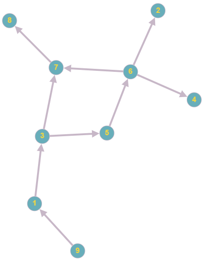
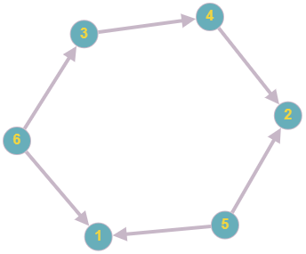

<details>
<summary><font size="+2">Задача 1. Вывод орграфа на консоль</font></summary><br>

Вам нужно реализовать вывод ориентированного графа на консоль.

Граф представлен матрицей смежности размерностью `N x N` — двумерный массив, содержащий `N` строчек и `N` столбцов.

`N` — это количество вершин графа. Все вершины графа пронумерованы, то есть имеют уникальный индекс от `1` до `N` включительно.

Значение, находящееся в ячейке матрицы смежности, говорит о наличии или отсутствии связи между вершинами, индексы которых соответствуют номеру строчки и номеру столбца этой ячейки. Если значение в ячейке равно `1`, то из вершины, имеющей номер строки ячейки, можно попасть в вершину, имеющую номер столбца ячейки. Если значение равно `0`, то из вершины, имеющей номер строки ячейки, нельзя попасть в вершину, имеющую номер столбца ячейки. В ячейках с одинаковыми номерами столбца и строки всегда находится `0`.

В отличие от неориентированного графа в матрице смежности ориентированного графа значения в ячейках, находящихся симметрично относительно диагонали матрицы, могут не совпадать. Это будет означать, что из одной вершины можно попасть в другую, но не наоборот. Ячейки, находящиеся симметрично относительно диагонали матрицы, обычно образуют пары. В этих парах номер строки первой ячейки будет равен номеру столбца второй ячейки, а номер столбца первой ячейки будет равен номеру строки второй ячейки.

Ваша задача — имея предоставленную матрицу смежности, вывести в текстовом виде на консоль ориентированный граф, который соответствует этой матрице смежности.

Матрица смежности будет задаваться в текстовом файле в формате: первым числом в файле идёт количество вершин графа (`N`). Далее располагаются `N` строчек, каждая из которых содержит `N` чисел — `1` или `0`.

Формат вывода: для каждой вершины выводится её номер и номера вершин, в которые можно попасть из этой вершины. Если из вершины нельзя попасть в другие вершины, напишите  `нет`.

<details>
<summary><font size="+1">Пример работы программы</font></summary>

##### Входящий файл `input.txt`:
```
9
0 0 1 0 0 0 0 0 0 
0 0 0 0 0 0 0 0 0 
0 0 0 0 1 0 1 0 0 
0 0 0 0 0 0 0 0 0 
0 0 0 0 0 1 0 0 0 
0 1 0 1 0 0 1 0 0 
0 0 0 0 0 0 0 1 0 
0 0 0 0 0 0 0 0 0 
1 0 0 0 0 0 0 0 0 
```

Визуализация графа: 
##### Консоль:
```
Текстовый вид орграфа:
1: 3
2: нет
3: 5 7
4: нет
5: 6
6: 2 4 7
7: 8
8: нет
9: 1
```
</details>
</details>
<br>

<details>
<summary><font size="+2">Task 1. Outputting the digraph to the console</font></summary><br>

You need to implement directed graph output to the console.

The graph is represented by an `N x N` adjacency matrix - a two-dimensional array containing `N` rows and `N` columns.

`N` is the number of vertices in the graph. All vertices of the graph are numbered, that is, they have a unique index from `1` to `N` inclusive.

The value found in a cell of the adjacency matrix indicates the presence or absence of a connection between the vertices, the indices of which correspond to the row number and column number of this cell. If the value in the cell is `1`, then from the vertex with the cell's row number, you can get to the vertex with the cell's column number. If the value is `0`, then it is impossible to get from a vertex with a cell row number to a vertex with a cell column number. Cells with the same column and row numbers always contain `0`.

Unlike an undirected graph, in the adjacency matrix of a directed graph, the values in cells located symmetrically relative to the diagonal of the matrix may not coincide. This will mean that you can get from one vertex to another, but not vice versa. Cells located symmetrically relative to the diagonal of the matrix usually form pairs. In these pairs, the row number of the first cell will be equal to the column number of the second cell, and the column number of the first cell will be equal to the row number of the second cell.

Your task is, given the provided adjacency matrix, to output in text form to the console a directed graph that corresponds to this adjacency matrix.

The adjacency matrix will be specified in a text file in the format: the first number in the file is the number of graph vertices (`N`). Next are `N` lines, each of which contains `N` numbers - `1` or `0`.

Output format: for each vertex its number and the numbers of vertices that can be reached from this vertex are displayed. If a vertex cannot reach other vertices, write `no`.

<details>
<summary><font size="+1">Example of program operation</font></summary>

##### Incoming file `input.txt`:
```
9
0 0 1 0 0 0 0 0 0 
0 0 0 0 0 0 0 0 0 
0 0 0 0 1 0 1 0 0 
0 0 0 0 0 0 0 0 0 
0 0 0 0 0 1 0 0 0 
0 1 0 1 0 0 1 0 0 
0 0 0 0 0 0 0 1 0 
0 0 0 0 0 0 0 0 0 
1 0 0 0 0 0 0 0 0 
```

Graph visualization: 
##### Console:
```
Text view of the digraph:
1: 3
2: no
3: 5 7
4: no
5: 6
6: 2 4 7
7: 8
8: no
9: 1
```
</details>
</details>
<br>

<details>
<summary><font size="+2">Задача 2. Топологическая сортировка орграфа</font></summary><br>

В этом задании нам нужно реализовать топологическую сортировку ациклического ориентированного графа

Граф представлен матрицей смежности размерностью `N x N` - то есть это двумерный массив, содержащий `N` строчек и `N` столбцов

`N` - это количество вершин графа. Все вершины графа пронумерованы - то есть имеют уникальный индекс от `1` до `N` включительно

Значение находящееся в ячейке матрицы смежности, говорит о наличии или отсутствии связи между вершинами, индексы которых соответствуют номеру строчки и номеру столбца этой ячейки. Если значение в ячейке равно `1`, то из вершины, имеющей номер строки ячейки, можно попасть в вершину, имеющую номер столбца ячейки. Если значение равно `0`, то из вершины, имеющей номер строки ячейки, нельзя попасть в вершину, имеющую номер столбца ячейки. В ячейках с одинаковыми номерами столбца и строки всегда находится `0`

В отличие от неориентированного графа, в матрице смежности ориентированного графа значения в ячейках, находящихся симметрично относительно диагонали матрицы (такие ячейки образуют пары, в этих парах номер строки первой ячейки будет равен номеру столбца второй ячейки, а номер столбца первой ячейки будет равен номеру строки второй ячейки) могут не совпадать - это будет означать, что из одной вершины можно попасть в другую, но не наоборот

Наша задача: имея предоставленную матрицу смежности, произвести топологическую сортировку ориентированного графа и вывести на консоль получившийся порядок вершин

Матрица смежности будет задаваться в текстовом файле в следующем формате: первым числом в файле идёт количество вершин графа (`N`). Далее располагаются `N` строчек, каждая из которых содержит `N` чисел - `1` или `0`

На выходе мы должны получить последовательность вершин, находящихся в топологическом порядке. Заметьте, что для одного и того же орграфа может существовать несколько топологических сортировок - в зависимости от того, с какой вершины вы начали обход графа

<details>
<summary><font size="+1">Пример работы программы</font></summary>

#### Пример 1
##### Входящий файл `input.txt`:
```
9
0 0 1 0 0 0 0 0 0 
0 0 0 0 0 0 0 0 0 
0 0 0 0 1 0 1 0 0 
0 0 0 0 0 0 0 0 0 
0 0 0 0 0 1 0 0 0 
0 1 0 1 0 0 1 0 0 
0 0 0 0 0 0 0 1 0 
0 0 0 0 0 0 0 0 0 
1 0 0 0 0 0 0 0 0 
```

Визуализация графа: 
##### Консоль:
```
Топологический порядок вершин: 9 1 3 5 6 7 8 4 2
```
#### Пример 2
##### Входящий файл `input.txt`:
```
6
0 0 0 0 0 0 
0 0 0 0 0 0 
0 0 0 1 0 0 
0 1 0 0 0 0 
1 1 0 0 0 0 
1 0 1 0 0 0 
```

Визуализация графа: 
##### Консоль:
```
Топологический порядок вершин: 6 5 3 4 2 1
```
</details>
</details>
<br>


<details>
<summary><font size="+2">Task 2. Topological sorting of a digraph</font></summary><br>

In this task we need to implement topological sorting of an acyclic directed graph

The graph is represented by an adjacency matrix of dimension `N x N` - that is, it is a two-dimensional array containing `N` rows and `N` columns

`N` is the number of vertices in the graph. All vertices of the graph are numbered - that is, they have a unique index from `1` to `N` inclusive

The value found in a cell of the adjacency matrix indicates the presence or absence of a connection between the vertices, the indices of which correspond to the row number and column number of this cell. If the value in the cell is `1`, then from the vertex with the cell's row number, you can get to the vertex with the cell's column number. If the value is `0`, then it is impossible to get from a vertex with a cell row number to a vertex with a cell column number. Cells with the same column and row numbers always contain `0`

Unlike an undirected graph, in the adjacency matrix of a directed graph the values in cells located symmetrically relative to the diagonal of the matrix (such cells form pairs, in these pairs the row number of the first cell will be equal to the column number of the second cell, and the column number of the first cell will be equal to the row number of the second cells) may not coincide - this will mean that from one vertex you can get to another, but not vice versa

Our task: having the provided adjacency matrix, perform a topological sort of the directed graph and display the resulting order of vertices on the console

The adjacency matrix will be specified in a text file in the following format: the first number in the file is the number of graph vertices (`N`). Next are `N` lines, each of which contains `N` numbers - `1` or `0`

At the output we should get a sequence of vertices that are in topological order. Note that for the same digraph there can be several topological sorts - depending on which vertex you started traversing the graph from

<details>
<summary><font size="+1">Example of program operation</font></summary>

#### Example 1
##### Input file `input.txt`:
```
9
0 0 1 0 0 0 0 0 0 
0 0 0 0 0 0 0 0 0 
0 0 0 0 1 0 1 0 0 
0 0 0 0 0 0 0 0 0 
0 0 0 0 0 1 0 0 0 
0 1 0 1 0 0 1 0 0 
0 0 0 0 0 0 0 1 0 
0 0 0 0 0 0 0 0 0 
1 0 0 0 0 0 0 0 0 
```

Graph visualization: 
##### Console:
```
Topological order of vertices: 9 1 3 5 6 7 8 4 2
```
#### Example 2
##### Input file `input.txt`:
```
6
0 0 0 0 0 0 
0 0 0 0 0 0 
0 0 0 1 0 0 
0 1 0 0 0 0 
1 1 0 0 0 0 
1 0 1 0 0 0 
```

Graph visualization: 
##### Console:
```
Topological order of vertices: 6 5 3 4 2 1
```
</details>
</details>
<br>